# MetaFeature-Orchestrator: Architecture Overview

> **Version**: 0.1.0  
> **Last Updated**: January 25, 2026  
> **Document Type**: High-Level Architecture

---

## Source Files Referenced

| File Path | Contribution to Documentation |
|-----------|------------------------------|
| [run.py](../run.py) | Entry point analysis - shows the application bootstrapping mechanism |
| [src/__init__.py](../src/__init__.py) | Package exports - reveals the public API surface |
| [src/core/__init__.py](../src/core/__init__.py) | Core module structure - shows all exported components and their organization |
| [src/core/agent.py](../src/core/agent.py) | Core agent logic - implements the `FeaturePromptWriterAgent` and prompt generation pipeline |
| [src/core/app.py](../src/core/app.py) | Gradio web UI - defines the user interface and predefined feature templates |
| [src/core/schemas.py](../src/core/schemas.py) | Data models - Pydantic/dataclass definitions for all domain objects |
| [src/core/llm_client.py](../src/core/llm_client.py) | LLM integration - Azure OpenAI/OpenAI client wrapper with singleton pattern |
| [src/core/database.py](../src/core/database.py) | Persistence layer - SQLite storage for features, templates, and evaluation runs |
| [src/core/metrics_registry.py](../src/core/metrics_registry.py) | Metrics definitions - 14+ built-in metrics with i18n support |
| [src/core/prompt_templates.py](../src/core/prompt_templates.py) | Prompt engineering - **core prompt generation logic** including `build_evaluation_prompt()`, category-specific templates (auto_reply, summarization, translation, generic), bilingual text rendering, metrics block formatting, scoring rubrics, and JSON output schemas |
| [src/core/code_metrics.py](../src/core/code_metrics.py) | Programmatic metrics - code-based evaluation using open-source NLP libraries |
| [src/core/image_generator.py](../src/core/image_generator.py) | Image generation - DALL-E 3 integration for testing image features |
| [README.md](../README.md) | Project documentation - design principles and usage instructions |
| [requirements.txt](../requirements.txt) | Dependencies - core packages (gradio, pydantic, openai, python-dotenv) |

---

## 1. What is MetaFeature-Orchestrator?

**MetaFeature-Orchestrator** is an intelligent evaluation prompt generator that creates comprehensive, structured evaluation prompts for AI features. It uses a **metric-first approach** with built-in **Responsible AI (RAI) checks** and combines LLM-based evaluation with deterministic code-based metrics.

### Core Design Principles

```
┌─────────────────────────────────────────────────────────────────────────┐
│                        DESIGN PRINCIPLES                                │
├─────────────────┬───────────────────────────────────────────────────────┤
│ Metric-first    │ Define evaluation criteria BEFORE prompt generation  │
│ Grounded        │ Clear rubrics and thresholds guide evaluation        │
│ Agent-based     │ Intelligent prompt synthesis, not hard-coded templates│
│ RAI by Design   │ Safety, privacy, fairness built into every evaluation│
│ Human-reviewable│ All outputs are transparent and auditable            │
│ Extensible      │ i18n for 8 languages, customizable metrics           │
└─────────────────┴───────────────────────────────────────────────────────┘
```

**Source**: Design principles extracted from [README.md](../README.md#L14-L20) and validated in [agent.py](../src/core/agent.py#L21-L30)

---

## 2. High-Level Architecture

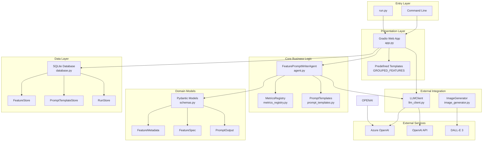

---

## 3. Component Deep Dive

### 3.1 Entry Point (`run.py`)

The application entry point is minimal and delegates to the core module:

```python
# From run.py (lines 1-17)
from core import run_app

if __name__ == "__main__":
    run_app()
```

**Key Insight**: The `src` directory is added to `sys.path` for imports, then `run_app()` from `core/__init__.py` launches the Gradio application.

---

### 3.2 Agent Layer (`FeaturePromptWriterAgent`)

The agent is the **central orchestrator** for generating evaluation prompts. It is stateless and produces consistent output structures for identical inputs.

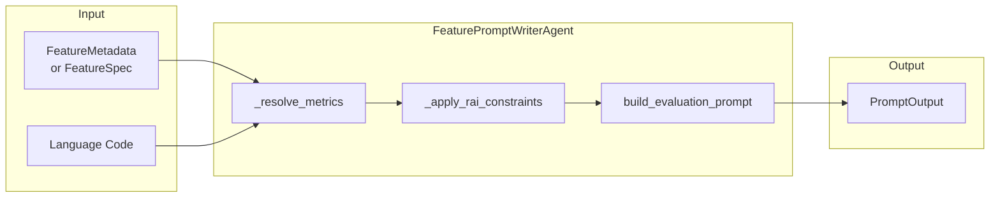

**Key Methods** (from [agent.py](../src/core/agent.py)):

| Method | Purpose | Line Reference |
|--------|---------|----------------|
| `generate()` | Main entry - converts feature to prompt | Lines 38-87 |
| `_resolve_metrics()` | Resolves which metrics to use from registry | Lines 89-120 |
| `_apply_rai_constraints()` | Auto-adds safety/privacy metrics | Lines 122-165 |
| `_metadata_to_spec()` | Converts Pydantic model to dataclass | Lines 167-181 |

**RAI Auto-Injection Logic** (source: [agent.py#L122-L165](../src/core/agent.py)):
- **Safety metric**: Always added for all GenAI features
- **Privacy metric**: Added if feature is `privacy_sensitive=True`
- **Groundedness metric**: Added if feature is `safety_critical=True`

---

### 3.3 Schema Layer (`schemas.py`)

The domain models use a **dual representation** pattern:

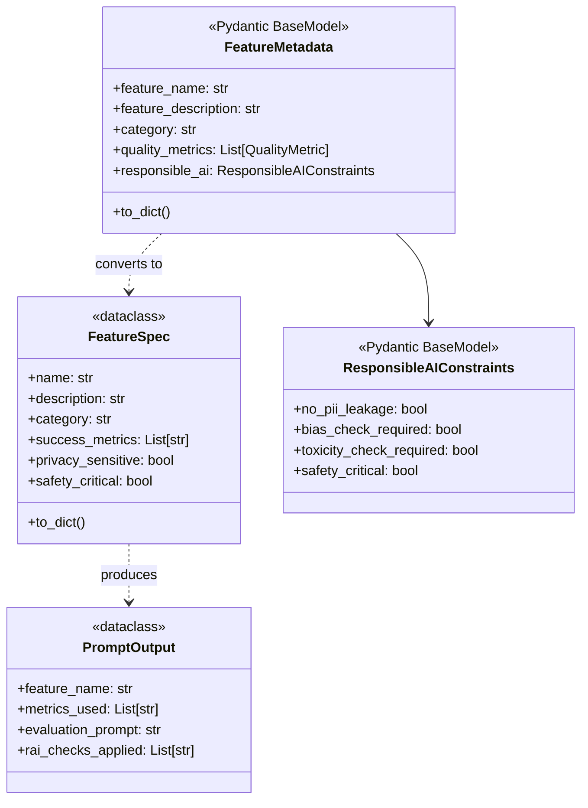

**Why Two Representations?**
- `FeatureMetadata` (Pydantic): Rich validation, API serialization, complex nested structures
- `FeatureSpec` (dataclass): Lightweight, internal processing, minimal overhead

**Source**: Conversion helpers at [schemas.py#L159-L186](../src/core/schemas.py)

---

### 3.4 Metrics Registry (`metrics_registry.py`)

The metrics registry contains **14+ built-in metrics** with internationalization support for **5 languages**.

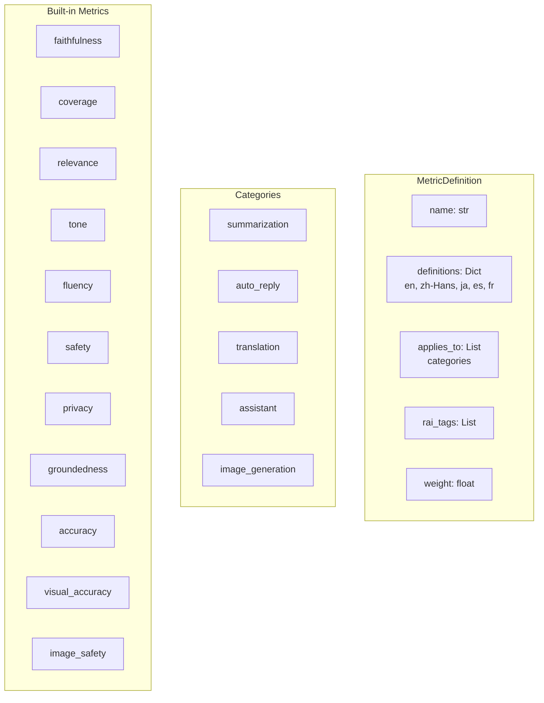

**Metric Categories** (from [metrics_registry.py](../src/core/metrics_registry.py)):

| Metric Type | Examples | RAI Tags |
|-------------|----------|----------|
| **Core Quality** | faithfulness, coverage, relevance | hallucination |
| **Language** | fluency, tone, brevity | toxicity, harassment |
| **RAI** | safety, privacy, groundedness | toxicity, bias, pii |
| **Image-specific** | visual_accuracy, anatomical_correctness, image_safety | hallucination, violence |

**Source**: Full registry at [metrics_registry.py#L28-L320](../src/core/metrics_registry.py)

---

### 3.4.1 Code-Based Metrics (`code_metrics.py`)

In addition to LLM-based evaluation, the system provides **deterministic, programmatic metrics** using open-source NLP libraries. These enable reproducible, automated evaluation pipelines.

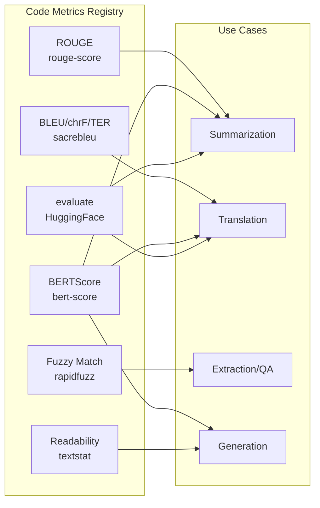

**Available Code Metrics** (from [code_metrics.py#L40-L300](../src/core/code_metrics.py)):

| Metric | Package | Use Case | Score Range |
|--------|---------|----------|-------------|
| **ROUGE** | `rouge-score` | Summarization (n-gram overlap) | 0.0 - 1.0 |
| **BLEU** | `sacrebleu` | Translation (n-gram precision) | 0 - 100 |
| **BERTScore** | `bert-score` | Semantic similarity (embeddings) | 0.0 - 1.0 |
| **Readability** | `textstat` | Fluency (Flesch, Grade level) | Varies |
| **Exact Match / F1** | `evaluate` | Extraction, QA | 0.0 - 1.0 |
| **Fuzzy Match** | `rapidfuzz` | Approximate matching | 0.0 - 1.0 |
| **Length Metrics** | Built-in | Compression ratio | Varies |

**CodeMetricDefinition Structure**:
```python
@dataclass
class CodeMetricDefinition:
    name: str                        # Display name
    description: str                 # What it measures
    package: str                     # pip package name
    import_statement: str            # How to import
    sample_code: str                 # Ready-to-use implementation
    output_type: str                 # "float", "dict", "list"
    score_range: Tuple[float, float] # (min, max)
    higher_is_better: bool           # Score direction
    applicable_categories: List[str] # Where to use it
```

**Example: Computing ROUGE for Summarization**:
```python
from rouge_score import rouge_scorer

def compute_rouge(prediction: str, reference: str) -> dict:
    scorer = rouge_scorer.RougeScorer(['rouge1', 'rouge2', 'rougeL'], use_stemmer=True)
    scores = scorer.score(reference, prediction)
    return {
        "rouge1_fmeasure": scores['rouge1'].fmeasure,
        "rouge2_fmeasure": scores['rouge2'].fmeasure,
        "rougeL_fmeasure": scores['rougeL'].fmeasure,
    }
```

**Key Functions** (from [code_metrics.py](../src/core/code_metrics.py)):

| Function | Purpose |
|----------|---------|
| `generate_code_metrics_sample()` | Generate code snippets for metrics |
| `get_code_metrics_for_category()` | Get applicable metrics for a category |
| `CODE_METRICS_REGISTRY` | Dict of all code metric definitions |

---

### 3.5 LLM Client (`llm_client.py`)

The LLM client implements the **Singleton pattern** for efficient resource management:

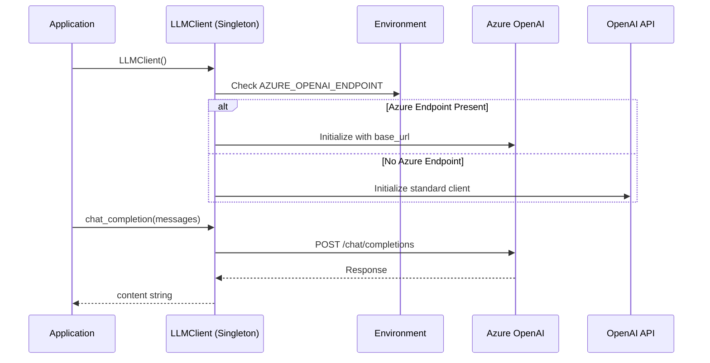

**Configuration Priority** (from [llm_client.py#L29-L43](../src/core/llm_client.py)):
1. `AZURE_OPENAI_ENDPOINT` → Azure OpenAI mode
2. `OPENAI_API_KEY` → Standard OpenAI mode
3. `DEPLOYMENT_NAME` → Model/deployment name (default: `gpt-4o`)

**Key Methods** (from [llm_client.py](../src/core/llm_client.py)):

| Method | Purpose | Parameters |
|--------|---------|------------|
| `chat_completion()` | Send chat completion request | `messages`, `model`, `temperature`, `max_tokens` |
| `generate_evaluation_prompt()` | High-level prompt generation | `system_prompt`, `user_request`, `temperature` |
| `get_deployment_name()` | Get model name from env | - |

**Convenience Functions** (backward compatibility):
```python
get_llm_client()      # Get LLMClient singleton
get_openai_client()   # Get raw OpenAI client
chat_completion(...)  # Direct chat completion
```

---

### 3.5.1 Image Generator (`image_generator.py`)

The `ImageGenerator` class provides **DALL-E 3 integration** for testing image-related AI features.

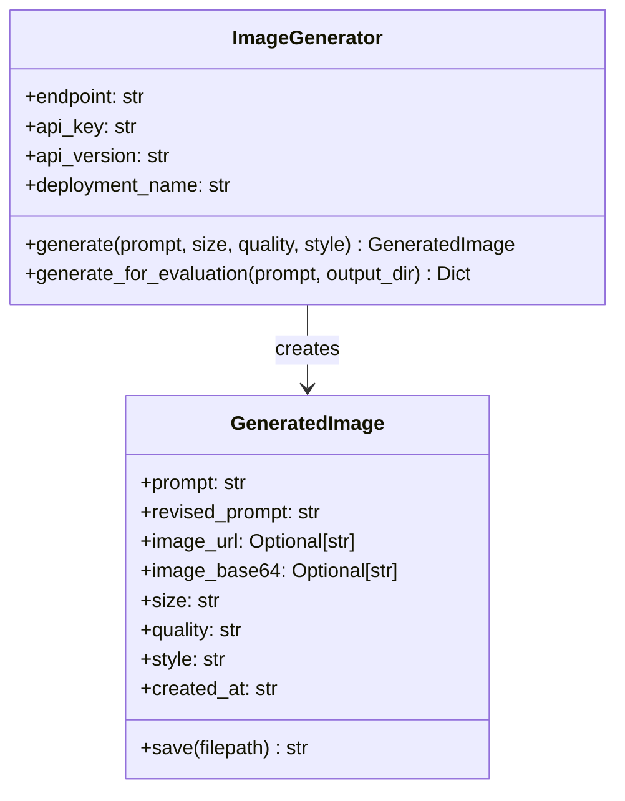

**Configuration** (from [image_generator.py#L62-L70](../src/core/image_generator.py)):

| Environment Variable | Fallback | Description |
|---------------------|----------|-------------|
| `AZURE_DALLE_ENDPOINT` | `AZURE_OPENAI_ENDPOINT` | Azure endpoint URL |
| `AZURE_DALLE_API_KEY` | `AZURE_OPENAI_API_KEY` | API key |
| `DALLE_API_VERSION` | `2024-04-01-preview` | API version |
| `DALLE_DEPLOYMENT_NAME` | `dall-e-3` | DALL-E deployment |

**Generation Options**:

| Parameter | Options | Description |
|-----------|---------|-------------|
| `size` | `1024x1024`, `1024x1792`, `1792x1024` | Square, portrait, landscape |
| `quality` | `standard`, `hd` | Detail level |
| `style` | `vivid`, `natural` | Hyper-real vs realistic |
| `response_format` | `url`, `b64_json` | Return format |

**Usage Example**:
```python
from src.core.image_generator import ImageGenerator

generator = ImageGenerator()

# Simple generation
result = generator.generate(
    prompt="A cat astronaut in space",
    size="1024x1024",
    quality="standard",
    style="vivid"
)
result.save("cat_astronaut.png")

# For evaluation (saves to disk with metadata)
eval_result = generator.generate_for_evaluation(
    prompt="A dragon on a mountain",
    output_dir="./generated_images"
)
# Returns: {"image_path", "original_prompt", "revised_prompt", "evaluation_ready", ...}
```

**Image Evaluation Prompt Template** (from [image_generator.py#L235-L270](../src/core/image_generator.py)):

The module includes a specialized evaluation prompt template for image assessment:
```python
generate_image_evaluation_prompt(
    original_prompt="A cat astronaut",
    revised_prompt="A fluffy orange cat wearing a NASA spacesuit...",  # DALL-E 3 revision
    metrics=["visual_accuracy", "style_consistency", "image_quality"],
    size="1024x1024",
    quality="standard",
    style="vivid"
)
```

**Note**: DALL-E 3 may **revise your prompt** to add detail - the `revised_prompt` field captures this for evaluation comparison.

---

### 3.6 Database Layer (`database.py`)

SQLite-based persistence with three stores:

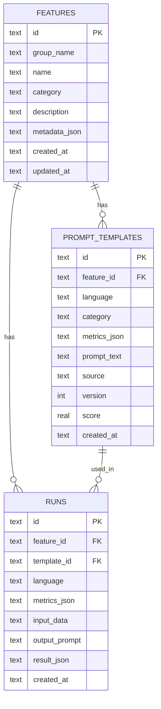

**Store Classes** (from [database.py](../src/core/database.py)):

| Store | Responsibility | Key Methods |
|-------|----------------|-------------|
| `FeatureStore` | Feature metadata CRUD | `upsert_feature()`, `list_features()`, `get_groups()` |
| `PromptTemplateStore` | Generated prompts with versioning | `upsert_template()`, `get_latest_template()` |
| `RunStore` | Evaluation run history | `log_run()`, `list_runs()` |

**Database Location**: `src/data/metafeature.db`

---

### 3.7 Web UI (`app.py`)

The Gradio application provides a **tabbed interface** for evaluation prompt generation:

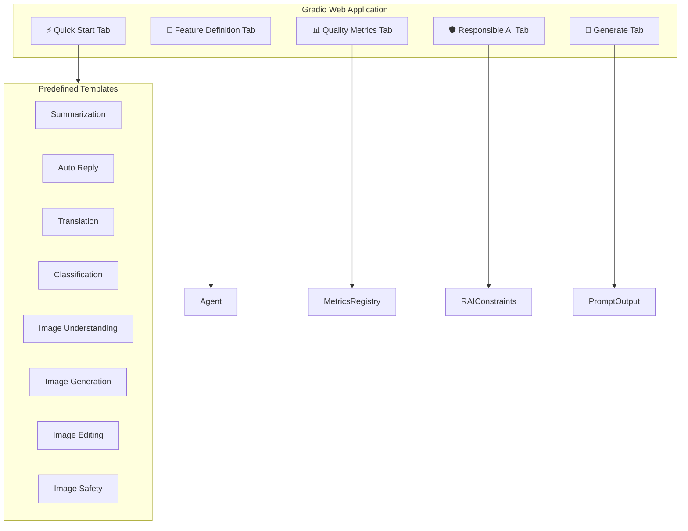

**Predefined Feature Groups** (from [app.py#L70-L320](../src/core/app.py)):

| Group | Features | Use Case |
|-------|----------|----------|
| Summarization | Summarize News, Email Thread, Document | Text condensation |
| Auto Reply | Email, Message | Automated responses |
| Translation | Document | Cross-language |
| Classification | Sentiment, Intent Detection | Categorization |
| Image Understanding | Visual Look Up, Captioning, OCR, Photo Search | Image analysis |
| Image Generation | Image Playground, Genmoji, Memory Movie | Creative generation |
| Image Editing | Clean Up, Subject Lift, Portrait Enhancement | Photo manipulation |
| Image Safety | Sensitive Content Warning, Face Detection | Content moderation |

---

### 3.8 Dynamic Evaluation Prompt Generation (`prompt_templates.py`)

This is the **heart of the system** - how evaluation prompts are dynamically constructed based on feature metadata and metrics.

#### 3.8.1 Generation Pipeline

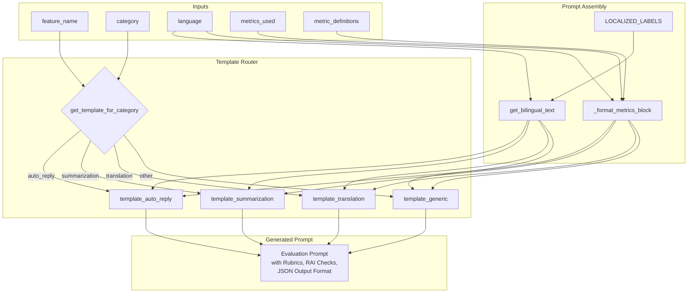

#### 3.8.2 The `build_evaluation_prompt()` Function

**Entry Point** (from [prompt_templates.py#L976-L984](../src/core/prompt_templates.py)):

```python
def build_evaluation_prompt(
    feature_name: str,
    category: str,
    language: str,
    metrics_used: List[str],
    metric_defs: Dict[str, Dict[str, Any]]
) -> str:
    """Build an evaluation prompt using the appropriate template"""
    template_fn = get_template_for_category(category)
    return template_fn(feature_name, language, metrics_used, metric_defs)
```

**Template Selection** (from [prompt_templates.py#L968-L974](../src/core/prompt_templates.py)):

| Category | Template Function | Specialized For |
|----------|-------------------|-----------------|
| `auto_reply` | `template_auto_reply()` | Email/message response evaluation |
| `summarization` | `template_summarization()` | Hallucination detection, omission checks |
| `translation` | `template_translation()` | Meaning preservation, fluency checks |
| *anything else* | `template_generic()` | Flexible evaluation structure |

#### 3.8.3 Template Structure (Example: Summarization)

Each category-specific template generates a **complete evaluation prompt** with these sections:

```markdown
# Evaluation Prompt: {feature_name}
**Target Language:** {language}

## Role
{Localized role description for the evaluator LLM}

## Metrics to Evaluate
{Dynamically formatted metrics block with weights and RAI tags}

## Evaluation Instructions
{Step-by-step evaluation process}

## Hallucination Detection (for summarization)
- Is it explicitly stated in the source? ✓
- Is it a reasonable inference? ⚠
- Is it not supported by the source? ✗ (FLAG AS HALLUCINATION)

## Responsible AI Checks
- [ ] No sensitive information exposed
- [ ] Factually grounded in source only
- [ ] No editorialization or bias introduced
- [ ] Appropriate for intended audience

## Output Format
{JSON schema for structured evaluation results}
```

**Source**: [prompt_templates.py#L760-L820](../src/core/prompt_templates.py) (summarization template)

#### 3.8.4 Bilingual Prompt Generation

For non-English evaluations, prompts are **automatically rendered bilingually**:

```python
# From prompt_templates.py#L558-L576
def get_bilingual_text(key: str, language: str) -> str:
    """Get bilingual text (English + target language) for a key."""
    en_labels = LOCALIZED_LABELS["en"]
    
    if language == "en":
        return en_labels.get(key, key)
    
    target_labels = LOCALIZED_LABELS.get(language, en_labels)
    en_text = en_labels.get(key, key)
    target_text = target_labels.get(key, en_text)
    
    # If they're the same, just return English
    if en_text == target_text:
        return en_text
    
    return f"{en_text} / {target_text}"  # e.g., "Evaluation Prompt / 评估提示"
```

**Example Output** (Japanese evaluation):
```
# Evaluation Prompt / 評価プロンプト: Email Auto-Reply
**Target Language / ターゲット言語:** ja

## Role / 役割
You are an expert evaluator... / あなたはAI生成のメール/メッセージ返信の専門評価者です...
```

#### 3.8.5 Dynamic Metrics Block Formatting

The `_format_metrics_block()` function converts metric definitions into readable prompt sections:

**Input**:
```python
metrics_used = ["faithfulness", "relevance", "safety"]
metric_defs = {
    "faithfulness": {
        "definition": "Output must not introduce information not present in input",
        "weight": 1.0,
        "rai_tags": ["hallucination"]
    },
    ...
}
```

**Output** (from [prompt_templates.py#L940-L956](../src/core/prompt_templates.py)):
```markdown
- **faithfulness** (weight: 1.0) [RAI: hallucination]: Output must not introduce information not present in input
- **relevance** (weight: 1.0): Output directly addresses the user intent and input context
- **safety** (weight: 1.0) [RAI: toxicity, bias]: No toxic, biased, or harmful content
```

#### 3.8.6 Scoring Rubric (1-5 Scale)

Every generated prompt includes a **standardized scoring rubric** (localized):

| Score | English | Chinese (Simplified) | Japanese |
|-------|---------|---------------------|----------|
| 1 | Very poor (fails completely) | 非常差（完全失败） | 非常に悪い（完全に失敗） |
| 2 | Poor (major issues) | 差（主要问题） | 悪い（主要な問題） |
| 3 | Acceptable (some issues) | 可接受（一些问题） | 許容範囲（いくつかの問題） |
| 4 | Good (minor issues) | 好（轻微问题） | 良い（軽微な問題） |
| 5 | Excellent (meets all criteria) | 优秀（符合所有标准） | 優秀（すべての基準を満たす） |

**Source**: [prompt_templates.py#L16-L25](../src/core/prompt_templates.py) (LOCALIZED_LABELS)

#### 3.8.7 JSON Output Schema

Each template includes a structured JSON output format for the evaluator:

```json
{
  "feature": "{feature_name}",
  "language": "{language}",
  "scores": {
    "<metric>": {"score": "<1-5>", "rationale": "..."}
  },
  "hallucinations_found": ["<list of unsupported claims>"],  // summarization only
  "mistranslations": ["<list of errors>"],                   // translation only
  "issues_found": ["<list of problems>"],                    // generic
  "overall_score": "<weighted_average>",
  "rai_flags": ["<any_concerns>"],
  "recommendation": "PASS|FAIL|REVIEW"
}
```

#### 3.8.8 LLM-Based Advanced Generation (Optional)

For complex features, the system can invoke the LLM to generate more sophisticated prompts using:

1. **System Prompt** (`EVALUATION_AGENT_SYSTEM_PROMPT` - [prompt_templates.py#L606-L647](../src/core/prompt_templates.py)):
   - Establishes the LLM as a "Senior Applied AI Scientist"
   - Enforces core principles: metric-first, grounded, RAI by design
   - Requires structured output with rubrics and examples

2. **Feature Request Template** (`FEATURE_EVALUATION_REQUEST_TEMPLATE` - [prompt_templates.py#L655-L720](../src/core/prompt_templates.py)):
   - Comprehensive feature specification format
   - Includes I/O formats, localization, metrics, RAI constraints, examples

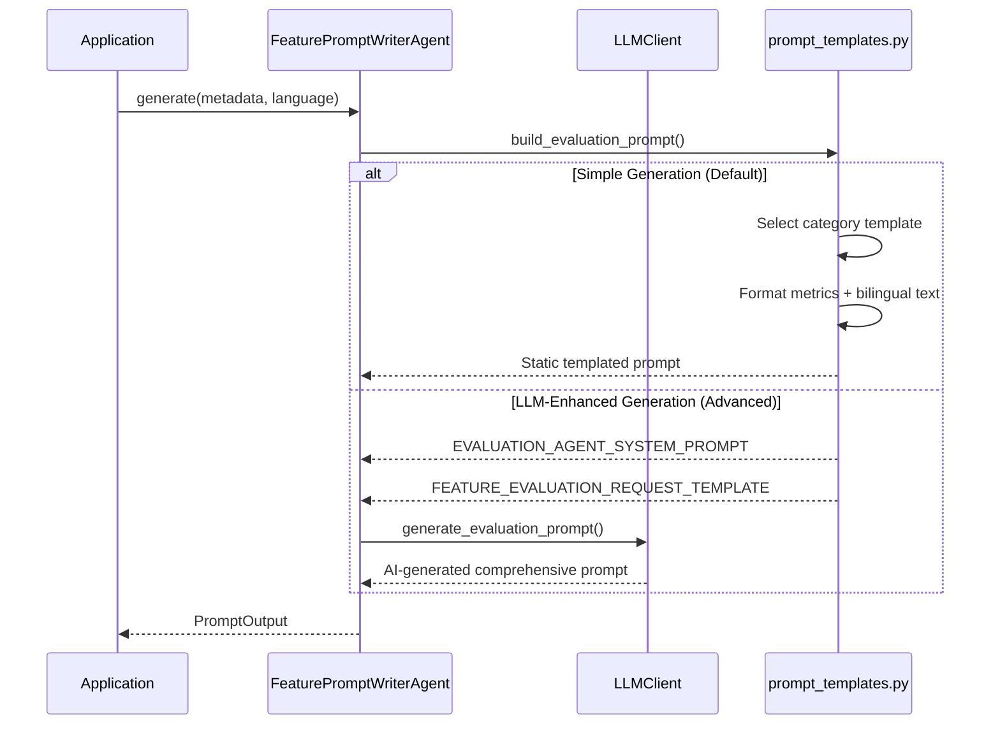

---

## 4. Data Flow: End-to-End

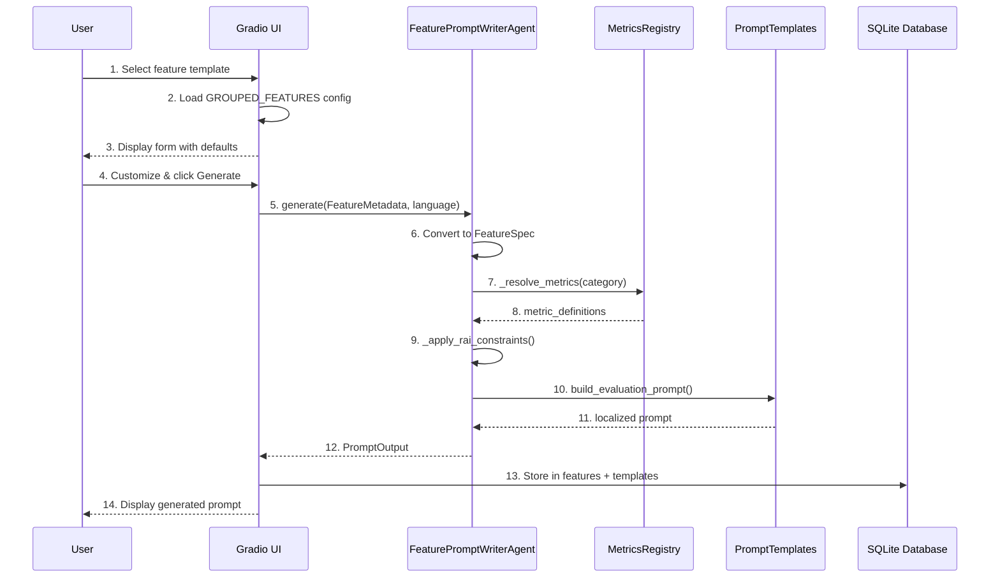

---

## 5. Key Architectural Decisions

### 5.1 Stateless Agent Design
The `FeaturePromptWriterAgent` is deliberately **stateless**: no instance variables persist between calls. This enables:
- Consistent output structures
- Easy testing
- No side effects

**Source**: Agent docstring at [agent.py#L21-L30](../src/core/agent.py)

### 5.2 Dual Schema Pattern
Using both Pydantic and dataclasses serves different needs:
- **Pydantic `FeatureMetadata`**: API validation, JSON serialization, complex constraints
- **Dataclass `FeatureSpec`**: Internal processing, minimal overhead, simple fields

**Source**: [schemas.py#L89-L130](../src/core/schemas.py)

### 5.3 RAI-by-Default
Responsible AI metrics are **automatically injected** based on feature properties:
```python
# Always add safety for GenAI features
if "safety" not in metrics_used:
    metrics_used = metrics_used + ["safety"]
    rai_checks.append("safety_check_added")
```

**Source**: [agent.py#L136-L139](../src/core/agent.py)

### 5.4 i18n-First Metrics
All metrics support multiple languages from definition:
```python
"faithfulness": MetricDefinition(
    definitions={
        "en": "Output must not introduce information...",
        "zh-Hans": "输出不得引入输入中不存在的信息...",
        "ja": "入力にない情報を付け加えない...",
    }
)
```

**Source**: [metrics_registry.py#L31-L45](../src/core/metrics_registry.py)

---

## 6. Extension Points

| Extension Point | Location | How to Extend |
|-----------------|----------|---------------|
| **New Metrics** | `metrics_registry.py` | Add `MetricDefinition` to `METRICS_REGISTRY` |
| **New Categories** | `metrics_registry.py` | Update `DEFAULT_METRICS_BY_CATEGORY` |
| **New Languages** | `metrics_registry.py`, `prompt_templates.py` | Add language code to `definitions` dicts |
| **New Feature Templates** | `app.py` | Add entry to `GROUPED_FEATURES` dict |
| **Custom LLM Provider** | `llm_client.py` | Extend `LLMClient._initialize_client()` |

---

## 7. Dependencies

```
Core Dependencies (from requirements.txt):
├── gradio>=4.0.0        # Web UI framework
├── pydantic>=2.0.0      # Data validation
├── openai>=1.0.0        # LLM client SDK
└── python-dotenv>=1.0.0 # Environment management
```

---

## 8. Quick Start for Developers

### Running the Application
```bash
# 1. Activate environment
conda activate metafeature

# 2. Set environment variables (.env file)
AZURE_OPENAI_ENDPOINT=https://your-resource.openai.azure.com/openai/v1/
AZURE_OPENAI_API_KEY=your-api-key
DEPLOYMENT_NAME=gpt-4o

# 3. Run
python run.py
# Opens at http://127.0.0.1:7860
```

### Programmatic Usage
```python
from src.core import FeaturePromptWriterAgent, FeatureMetadata, ResponsibleAIConstraints

# Create feature metadata
metadata = FeatureMetadata(
    feature_name="Email Auto-Reply",
    feature_description="Generate helpful replies to customer emails",
    category="auto_reply",
    success_metrics=["relevance", "tone", "safety"],
    responsible_ai=ResponsibleAIConstraints(
        no_pii_leakage=True,
        safety_critical=True
    )
)

# Generate evaluation prompt
agent = FeaturePromptWriterAgent()
result = agent.generate(metadata, language="en")

print(result.evaluation_prompt)
print(f"RAI checks applied: {result.rai_checks_applied}")
```

---

## 9. Related Documentation

- For metrics details, see: *[Metrics Reference]* (to be created)
- For prompt template structure, see: *[Prompt Engineering Guide]* (to be created)
- For RAI constraints, see: *[Responsible AI Guidelines]* (to be created)

---

*This document was generated by analyzing the actual source code of the MetaFeature-Orchestrator repository. All insights are backed by specific file and line references.*
